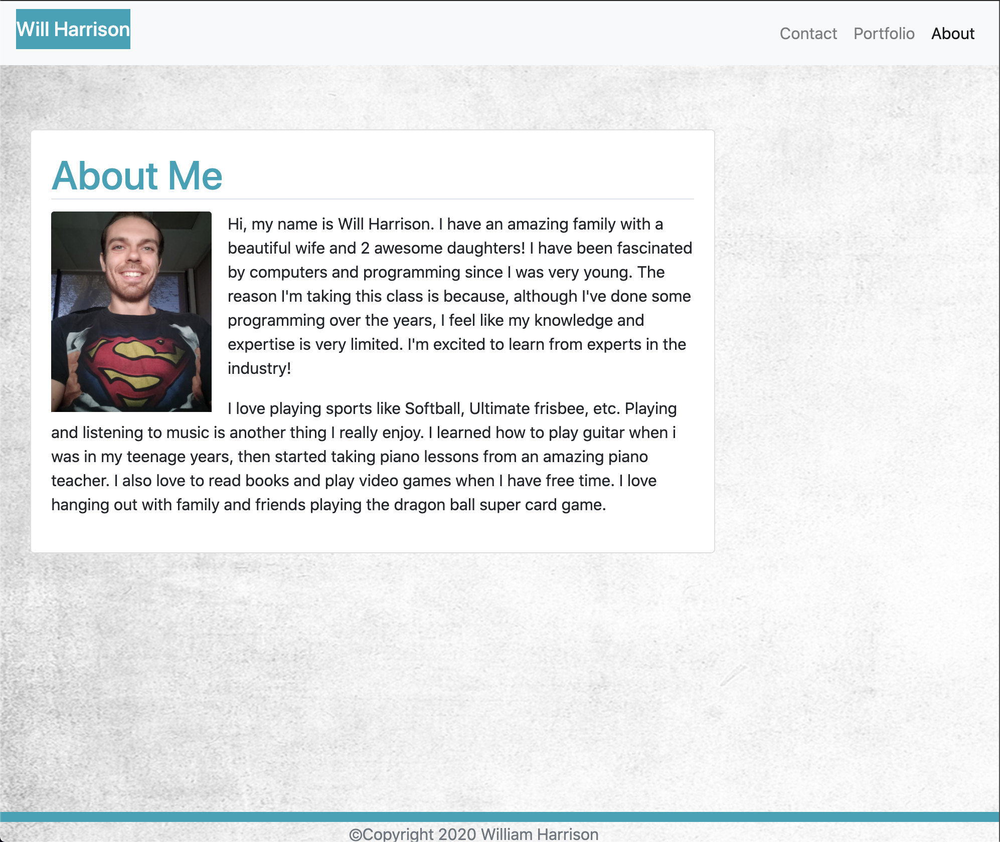
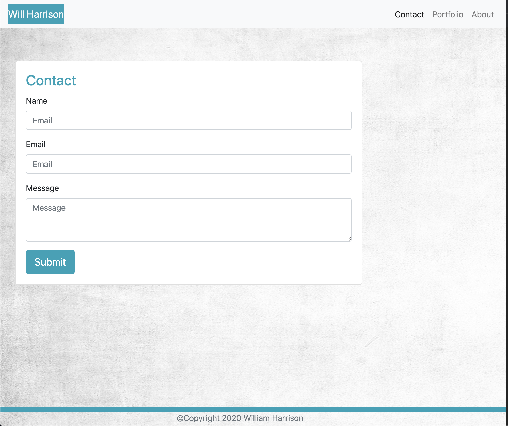
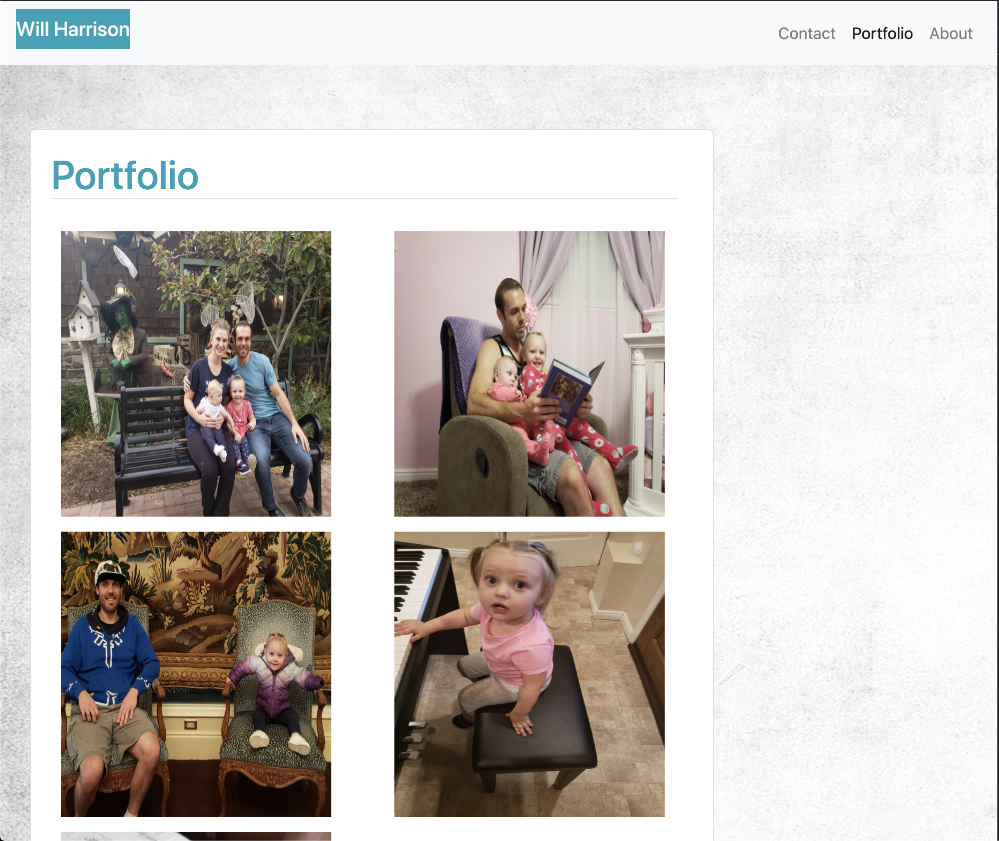

# Unit 02 CSS and Bootstrap Homework: Responsive Portfolio

This is my responsive portfolio website

## Github Pages link to running deployed application
https://willh33.github.io/will_h_homework_2/

## Screenshots

  
  
  

